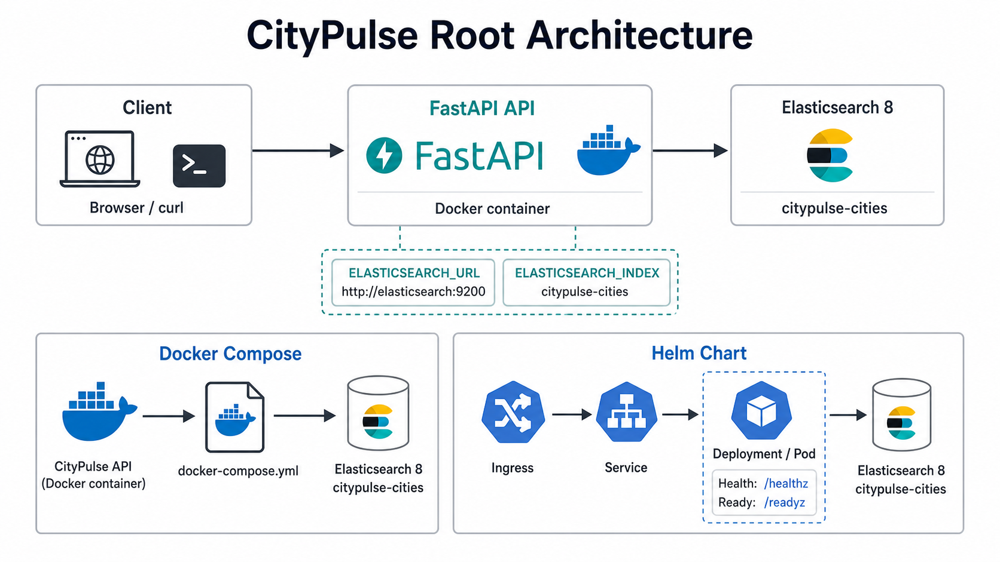
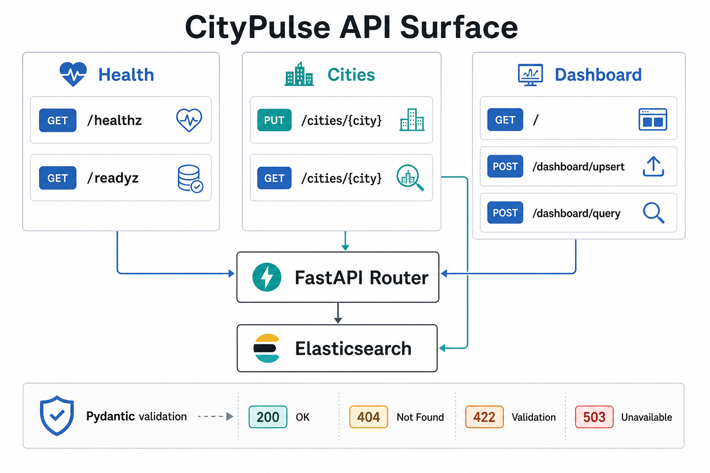
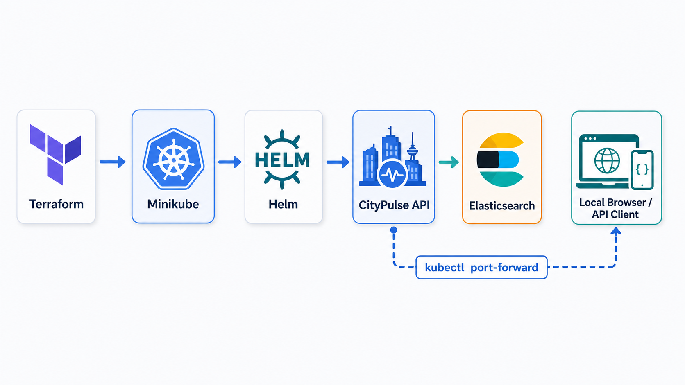

# CityPulse


CityPulse is a FastAPI SRE take-home project for managing city population data. It includes REST API endpoints, Elasticsearch persistence, a server-rendered admin dashboard, Docker Compose for local use, and a Helm chart for Kubernetes deployment.

## Visuals

### Root Architecture



### API Surface



## Features

- Health endpoint: `GET /healthz`
- Readiness endpoint: `GET /readyz`
- Upsert city population: `PUT /cities/{city}`
- Query city population: `GET /cities/{city}`
- Elasticsearch-backed storage
- Server-rendered admin dashboard at `/`
- Dashboard auto-seeds demo city records when Elasticsearch is reachable
- Docker Compose and Kubernetes deployment assets

## Local Python Setup

```bash
python3 -m venv .venv
source .venv/bin/activate
pip install -r requirements-dev.txt
```

Run tests:

```bash
pytest
```

Run the app against an existing Elasticsearch instance:

```bash
export ELASTICSEARCH_URL=http://localhost:9200
export ELASTICSEARCH_INDEX=citypulse-cities
uvicorn app.main:app --reload
```

Open the dashboard:

```text
http://localhost:8000
```

## API Examples

```bash
curl http://localhost:8000/healthz
```

```bash
curl -X PUT http://localhost:8000/cities/Dubai \
  -H 'Content-Type: application/json' \
  -d '{"population":3331420}'
```

```bash
curl http://localhost:8000/cities/Dubai
```

## Docker Compose

Start the application and Elasticsearch:

```bash
docker compose up --build
```

Then open:

```text
http://localhost:8000
```

Stop and remove containers:

```bash
docker compose down
```

## Kubernetes Deployment With Helm

The chart is portable across local, cloud, and on-prem Kubernetes. By default it deploys CityPulse plus a simple single-node Elasticsearch instance suitable for demos.

```bash
helm upgrade --install citypulse ./helm/citypulse \
  --namespace citypulse \
  --create-namespace \
  --set image.repository=umar20/citypulse \
  --set image.tag=1.1.0
```

To use managed Elasticsearch instead:

```bash
helm upgrade --install citypulse ./helm/citypulse \
  --namespace citypulse \
  --create-namespace \
  --set image.repository=umar20/citypulse \
  --set image.tag=1.1.0 \
  --set elasticsearch.enabled=false \
  --set env.elasticsearchUrl=https://your-elasticsearch.example.com
```

Port-forward the service:

```bash
kubectl port-forward -n citypulse svc/citypulse 8080:80
```

Open:

```text
http://localhost:8080
```

Validate the Helm chart:

```bash
helm lint ./helm/citypulse
helm template citypulse ./helm/citypulse
```

## Bonus Deployments

### Automated Minikube With Terraform



The `bonus/minikube-terraform` module creates a Minikube cluster and installs CityPulse with the same Helm chart:

```bash
cd bonus/minikube-terraform
terraform init
terraform apply -auto-approve
```

Then:

```bash
kubectl port-forward -n citypulse svc/citypulse 8080:80
```

### Public AWS K3s Demo With Terraform


The `bonus/aws-k3s-terraform` module creates a short-lived public demo on AWS using one EC2 instance running K3s. It uses the same Docker image and Helm chart, creates a Route 53 record, and avoids EKS control-plane and AWS load balancer costs.

```bash
cd bonus/aws-k3s-terraform
terraform init
terraform apply -auto-approve
```

Default public URL:

```text
http://citypulse.clawstack.cloud
```

Clean up the AWS demo after review:

```bash
terraform destroy -auto-approve
```

## Configuration

| Variable | Default | Description |
| --- | --- | --- |
| `ELASTICSEARCH_URL` | `http://localhost:9200` | Elasticsearch endpoint |
| `ELASTICSEARCH_INDEX` | `citypulse-cities` | Index used for city records |

## Reflection

See [docs/reflection.md](docs/reflection.md) for implementation challenges and production scaling suggestions.
