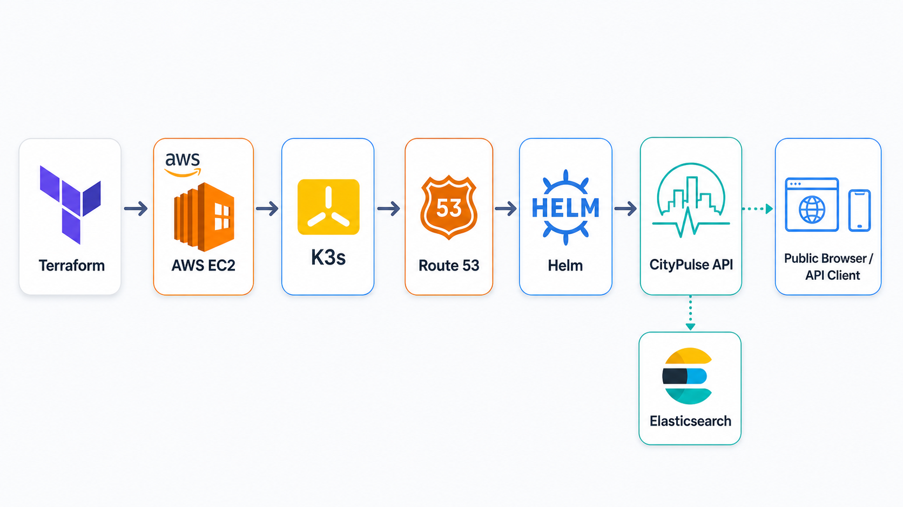

# CityPulse AWS K3s Terraform Bonus

This bonus module deploys CityPulse publicly on AWS using one low-cost EC2 instance running K3s.



## What It Creates

- A public EC2 instance running K3s.
- A security group with HTTP open publicly and SSH/K3s API restricted to the current public IP.
- A Route 53 `A` record under `clawstack.cloud`.
- The shared `helm/citypulse` chart installed into K3s.
- A local SSH key for demo access, ignored by git.

This is intentionally cheaper than EKS. Main costs are the EC2 instance, EBS volume, and public IPv4 address. Destroy the stack after the demo.

## Deploy

```bash
cd bonus/aws-k3s-terraform
terraform init
terraform apply -auto-approve
```

Default URL:

```text
http://citypulse.clawstack.cloud
```

## Test

```bash
curl http://citypulse.clawstack.cloud/healthz
curl http://citypulse.clawstack.cloud/readyz

curl -X PUT http://citypulse.clawstack.cloud/cities/Dubai \
  -H 'Content-Type: application/json' \
  -d '{"population":3331420}'

curl http://citypulse.clawstack.cloud/cities/Dubai
```

## SSH

Terraform writes a local private key at `citypulse-k3s-key.pem`.

```bash
ssh -i citypulse-k3s-key.pem ubuntu@$(terraform output -raw public_ip)
```

Inside the instance:

```bash
sudo kubectl get pods -n citypulse
sudo helm list -n citypulse
```

## Terraform Layout

- `versions.tf`: Terraform and provider constraints.
- `providers.tf`: AWS and Helm provider configuration.
- `main.tf`: AWS, DNS, SSH, and K3s readiness resources.
- `helm.tf`: CityPulse Helm release with lightweight resource settings.
- `variables.tf`: Inputs for AWS profile, region, instance, DNS, and image.
- `outputs.tf`: Public URL, SSH command, and smoke test commands.

## Cleanup

```bash
terraform destroy -auto-approve
```
